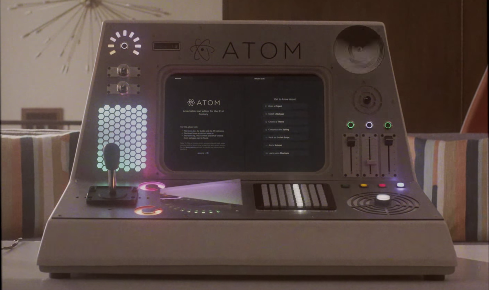
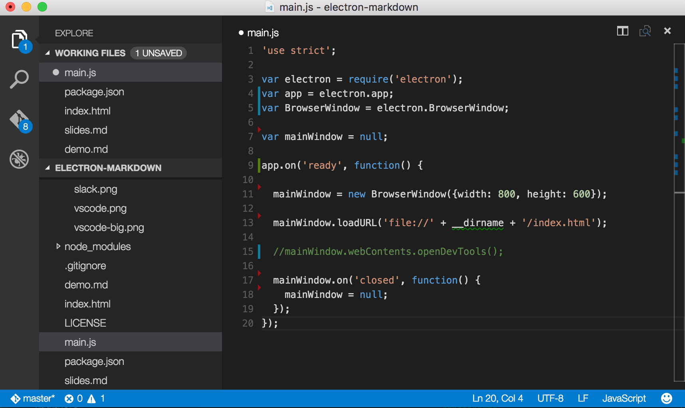
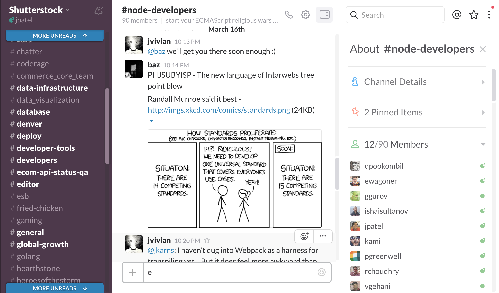
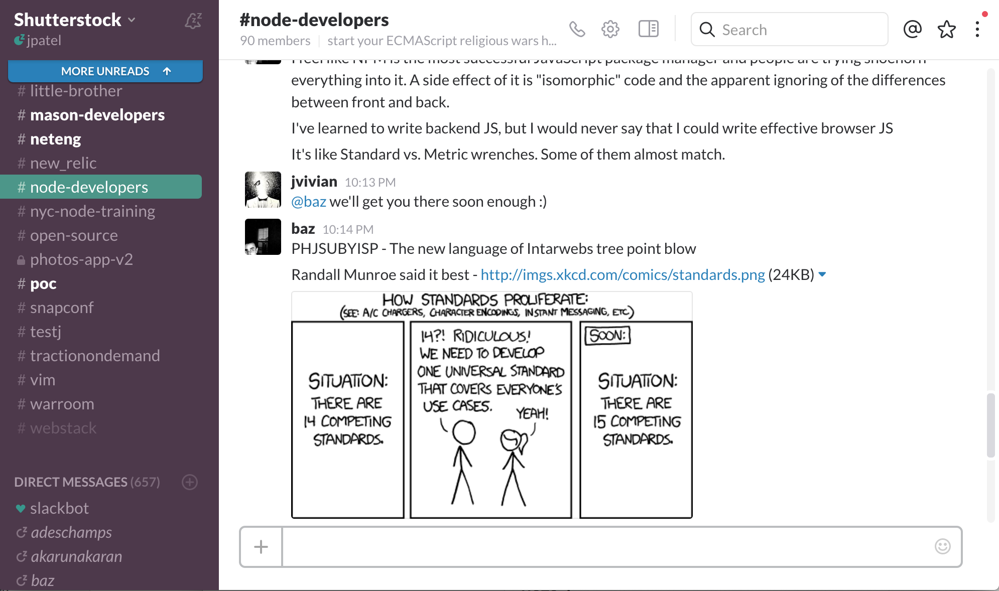
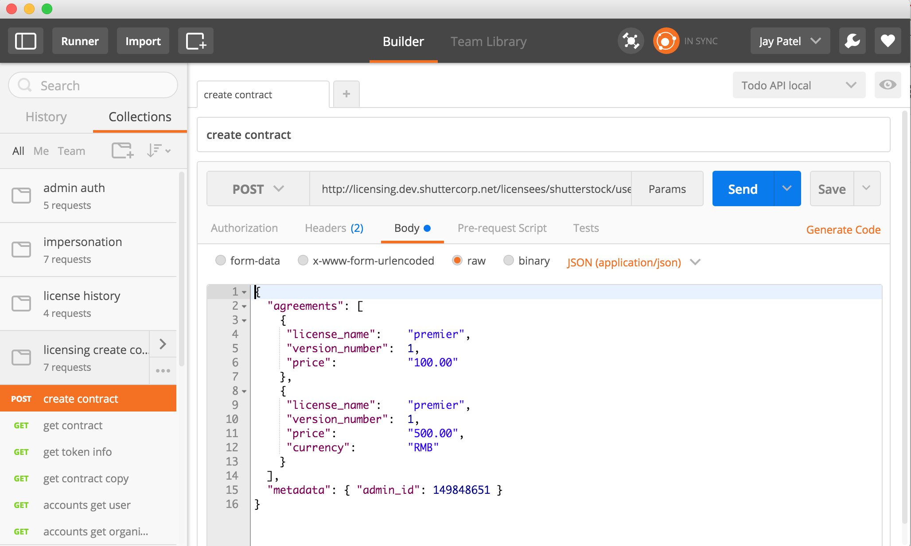
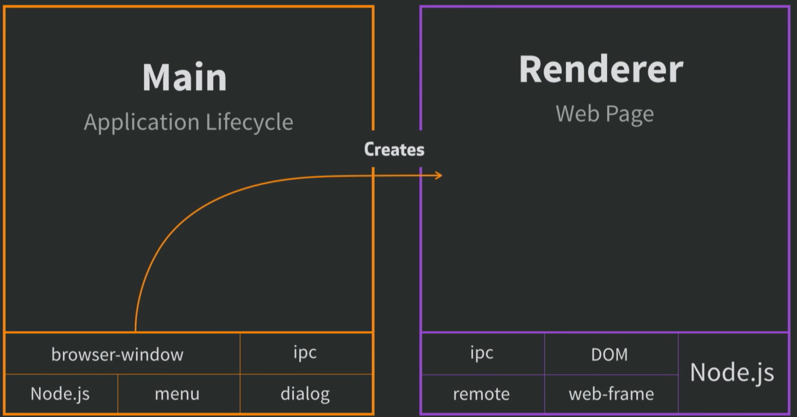

# Desktop Apps with Javascript

----

What it is
Why to do it
Follow up with an example

----

    > Any application that can be written in JavaScript, will eventually be written in JavaScript. - Jeff Atwood (2007)

* https://github.com/os-js/OS.js  <!-- .element: class="fragment" data-fragment-index="1" -->
* https://github.com/1j01/jspaint  <!-- .element: class="fragment" data-fragment-index="2" -->
* https://github.com/pypyjs/pypyjs  <!-- .element: class="fragment" data-fragment-index="3" -->
* https://github.com/kripken/emscripten  <!-- .element: class="fragment" data-fragment-index="4" -->
* https://github.com/atom/electron  <!-- .element: class="fragment" data-fragment-index="5" -->
* https://github.com/fglock/Perlito  <!-- .element: class="fragment" data-fragment-index="6" -->

---

## Why desktop apps?
* can access the file system  <!-- .element: class="fragment" data-fragment-index="1" -->
* can access the clipboard  <!-- .element: class="fragment" data-fragment-index="2" -->
* can adjust menus <!-- .element: class="fragment" data-fragment-index="3" -->
* can integrate with the os  (open in finder, widgets, notification) <!-- .element: class="fragment" data-fragment-index="4" -->

---

## Why Electron?
* cross platform
* ease of use / code reuse

Note:
* In javascript (don’t need to learn native frameworks)
* but not mobile (yet)
* node on the frontend
* fs injection into dom
* Useful for backend engineers to make meaningful frontends

---

## Examples of existing apps

    
    

----

## The original (atom shell)

----

## vs code

Note:
* microsoft, open source
* chose it over their existing well known / popular ide

----

## slack

Note:
* started as a native mac app
* electron on windows and then back ported
* side by side comparison with web

----

## Totally not desktop app

----

## Postman

Note:
* started as a chrome app

----

## mojibar
* Native system tray app to find the perfect emoji

---

## What is Electron?

Note:
* tool for building cross platform native apps with native technology
    * javascript/ html, css
    * electron
    * OS

----

#### Electron is a specific version of node with a specific version of libchromiumcontent.

* designing only for one browser
* access to the dom / chrome dev tools
* access to node libraries
* any frontend javascript framework.
* any backend javascript library.

Note:
* combines libchromiumcontent and node into a single runtime.
* mac app store
* native dialogs
* (angular react ember) node

----

Note:
Electron has at least two processes.
The main that handles app lifecycle and then the renderer process.
They talk to each other with ipc.
There can be multiple renderers (each with its own v8).

---

# DEMO

---

## What is NWJS?

Note:
* tool for building cross platform native apps with native technology
    * javascript/ html, css
    * electron
    * OS

---

#### NWJS is a specific version of node with a specific version of chromium.

* same as Electron
* can use Chrome Apps & Extentions
* using HTML5 proprietary audio codecs requires custom build
* slower release cycle
* shared context between windows
* ship binary data to hide sensitive info

Note:
* combines chromium and node into a single runtime.
* (angular react ember) node

---

# DEMO

---

#### Other Options

* Chrome App
* Chromimum Embedded Framework

Note:
* Chrome Apps were a moving target
* Building Chromium Embedded Framework required xcode, editing xml to make your menus and more fun

---

## Resources:

Homepage : http://electron.atom.io

[Slides/Demo Source](https://github.com/jay3686/electron-markdown-example)

### Examples and sample code:
* https://github.com/benogle/curve-app
* https://github.com/sindresorhus/awesome-electron
* https://github.com/hokein/electron-sample-apps

----
